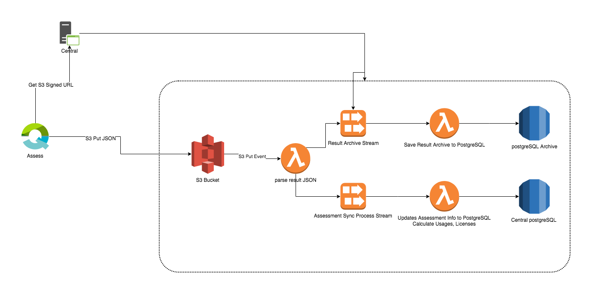

# Architecture



## Setting travis and coveralls badges
1. Sign in to [travis](https://travis-ci.org/) and activate the build for your project.
2. Sign in to [coveralls](https://coveralls.io/) and activate the build for your project.
3. Replace {{github-user-name}}/{{github-app-name}} with your repo details like: "ospatil/generator-node-typescript".


## Curl to upload to S3

```sh
curl -X PUT -T ./__tests__/jsons/3.json \
 -H "Content-Type: application/json"  -H "x-amz-meta-pract: Jane" -H "x-amz-meta-returnControl: 0" \
 http://localhost:8000/qi-sync-battery-local-resultsjson/resultJsons/1001/data.json
```

or full curl command -
```sh
date=`date +%Y%m%d`
dateFormatted=`date -R`
s3Bucket="BUCKET_OF_S3_SERVER"
fileName="FILE_NAME"
relativePath="/${s3Bucket}/${fileName}"
contentType="application/octet-stream"
stringToSign="PUT\n\n${contentType}\n${dateFormatted}\n${relativePath}"
s3AccessKey="ACCESS_KEY_OF_S3_SERVER"
s3SecretKey="SECRET_KEY_OF_S3_SERVER"
signature=`echo -en ${stringToSign} | openssl sha1 -hmac ${s3SecretKey} -binary | base64`
curl -X PUT -T "${fileName}" \
-H "Host: ${s3Bucket}.s3.amazonaws.com" \
-H "Date: ${dateFormatted}" \
-H "Content-Type: ${contentType}" \
-H "Authorization: AWS ${s3AccessKey}:${signature}" \
 
http://${s3Bucket}.s3.amazonaws.com/${fileName}
```